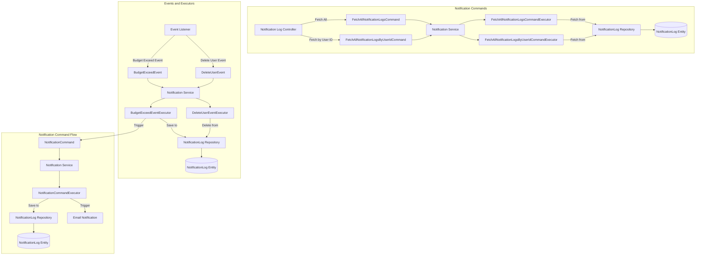
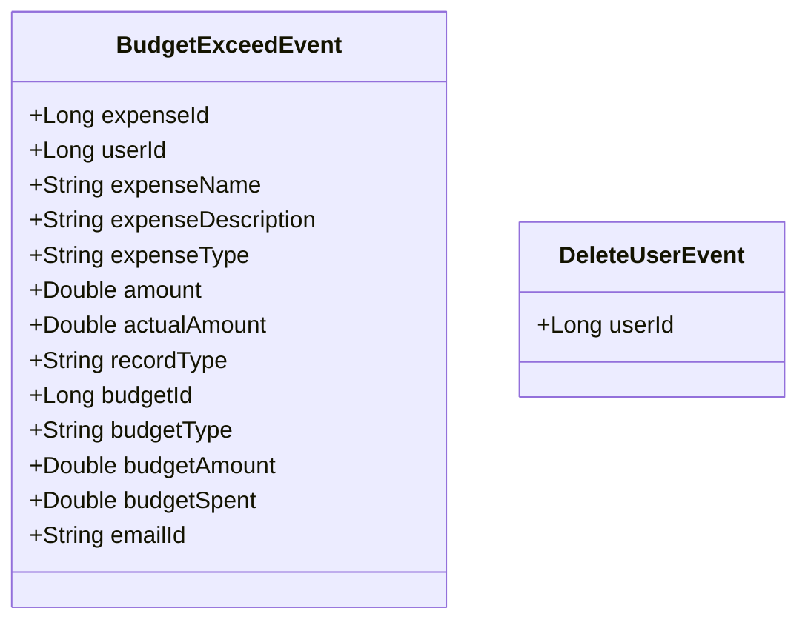
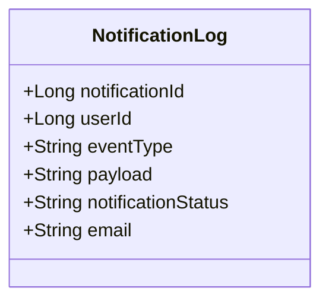
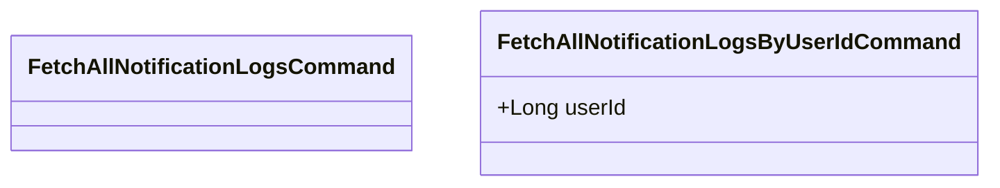
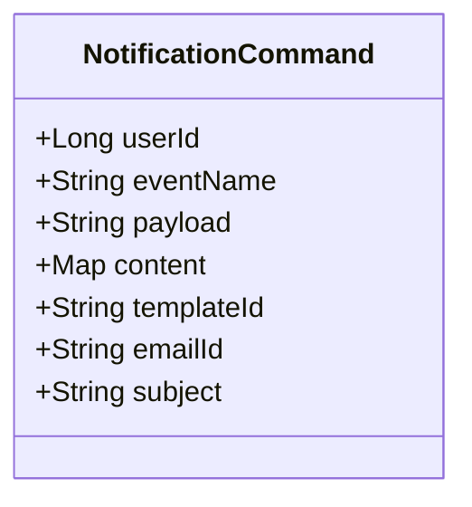

# Notification Service System

## Overview

The Notification Service System is designed to manage notifications, handle events, process commands, and interact with entities through queries. It follows an event-driven architecture to ensure decoupling and scalability.

## Sample output:


## Components

### Notification Service

The `Notification Service` executes commands related to notifications and processes events. It interacts with repositories to fetch, save, or delete notification logs.

### Event-Driven Architecture

The system uses an event-driven architecture where events trigger specific actions within the system. This design enhances scalability and maintainability.

## Process Flow Diagram


### Notification Commands

1. **Notification Log Controller** receives HTTP requests and creates commands.
2. Commands are sent to the `Notification Service`.
3. The `Notification Service` invokes the corresponding Command Executors.
4. Executors interact with the `NotificationLog Repository` to fetch or save data.
5. The `NotificationLog Repository` performs operations on the `NotificationLog Entity` (DB).

### Events and Executors

1. **Event Listener** receives events and invokes the appropriate Event Executors.
2. The `BudgetExceedEvent` and `DeleteUserEvent` trigger specific actions within the `Notification Service`.
3. Executors interact with the `NotificationLog Repository` to perform operations based on the events.
4. The `NotificationLog Repository` updates or deletes records in the `NotificationLog Entity` (DB).

### Notification Command Flow

1. **Event Executors** trigger `NotificationCommand`.
2. The `NotificationCommand` is processed by the `Notification Service`.
3. The `NotificationCommandExecutor` handles the command, triggers email notifications, and interacts with the `NotificationLog Repository`.
4. The `NotificationLog Repository` updates the `NotificationLog Entity` (DB) with the notification details.

## Class Diagrams

### 1. Event Class Diagram



### 2. Entity Class Diagram



### 3. Query Class Diagram



### 4. Command Class Diagram




## Getting Started

To run the service locally:

1. **Clone the repository**:
   ```bash
   git clone https://github.com/viswarajramji/notification.git
   cd notification
   ```

2. **Build the application**:
   ```bash
   ./mvnw clean install
   ```

3. **Start the application**:
   ```bash
   ./mvnw spring-boot:run
   ```

4. **Access the application** at `http://localhost:8088`.

5. **Access the database** at `http://localhost:8088/h2-console`.

**Note**: Ensure Kafka is running and the topic `notificationservice` is created.

## Swagger Endpoint

Access the Swagger UI to interact with the API:

- **URL**: `http://localhost:8088/swagger-ui.html`
